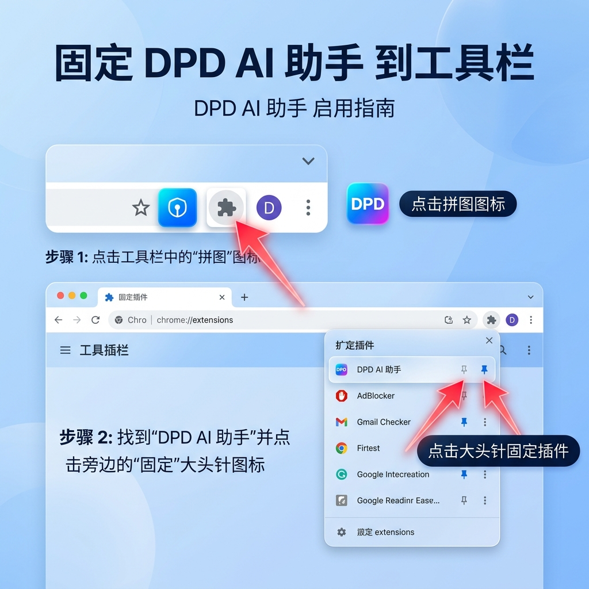

# DPD API 和 Chrome 扩展程序

Next.js 后端加上一个 Chrome 扩展程序，利用 AI 解析粘贴的 Excel 货运行数据，并自动填入 myDPD Business 表单。

---

如果您是开发人员，请参考 [DEVELOPMENT.md](./DEVELOPMENT.md) 了解环境配置与部署细节。

## 🚀 快速开始（安装指南）

### 1. 下载插件
前往 [GitHub Releases](https://github.com/folgercn/dpd-api/releases) 页面，下载最新版本的 `dpd-extension.zip`。

### 2. 安装插件

1. 下载后请先 **解压** ZIP 文件到一个固定目录。
2. 打开 Chrome 浏览器，在地址栏输入 `chrome://extensions/` 并回车。
3. 在右上角开启 **“开发者模式” (Developer mode)**。
4. 点击左上角的 **“加载已解压的扩展程序” (Load unpacked)**。
5. 选择您刚才解压的文件夹。
6. 安装成功后，建议点击浏览器右上角的“拼图”图标，将 **DPD AI 助手** 固定到工具栏。
   

## 💡 使用方法
1. 从 Excel 中直接复制包含 18 列地址信息的行数据。
2. 在插件窗口中粘贴文本。
3. 确保您已登录 DPD Business 官网。
4. 点击 **“立即填入 DPD 表单”**。
5. 系统将根据包裹重量自动解析并跳转至正确的页面（发货页或退货页）完成填写。

## 支持的 DPD 页面

### 20kg 以下 / 退货 (Return)
`https://business.dpd.de/retouren/retoure-beauftragen.aspx`

### 20kg 以上
`https://business.dpd.de/auftragsstart/auftrag-starten.aspx`

## 🔄 如何更新插件

本插件支持 **自动版本检测**，确保您始终使用最新的识别逻辑和功能。

### 1. 接收更新提示
当有新版本发布时，插件窗口顶部会自动弹出黄色的提示条：**“🚀 发现新版本 v1.x.x! [立即下载]”**。

### 2. 下载与覆盖
1. 点击提示条中的 **“立即下载”**，或前往 [GitHub Releases](https://github.com/folgercn/dpd-api/releases) 下载最新的 `dpd-extension.zip`。
2. 将下载的 ZIP 包 **解压**。
3. **覆盖安装**：将解压后的所有文件，复制并粘贴到您第一次安装时的那个文件夹中，选择 **“替换所有文件”**。

### 3. 生效更新
1. 在 Chrome 的插件管理页面 `chrome://extensions/` 找到 DPD AI 助手。
2. 点击插件卡片右下角的 **“刷新”（圆形箭头）** 图标。
3. 更新完成！

### 4. 查看当前版本号
您可以随时点击插件图标，在弹出窗口顶部的标题旁边（例如 **v1.0.18**）查看当前正在运行的版本。

