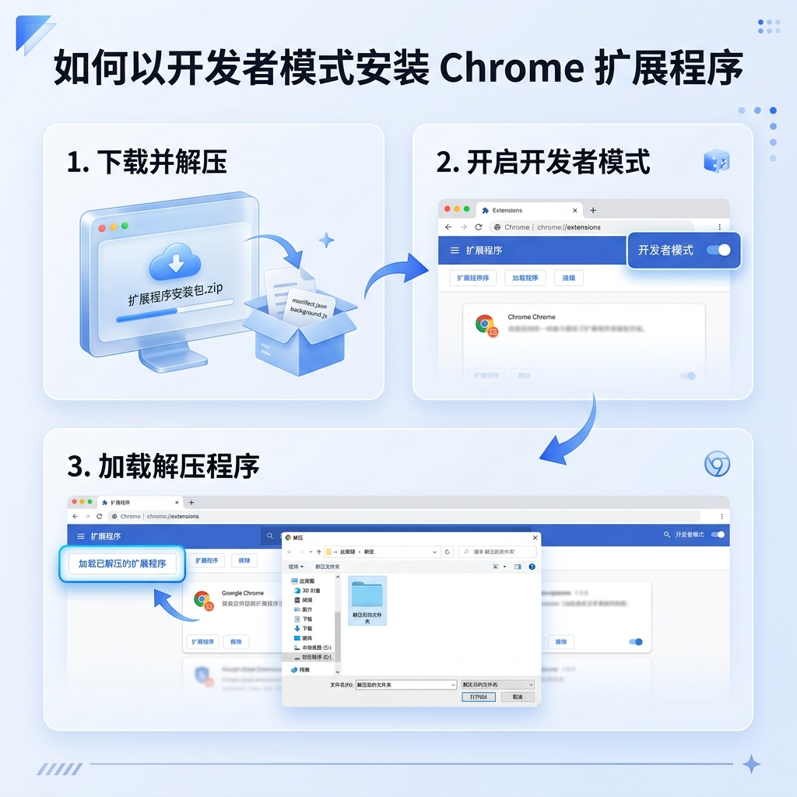

# DPD API 和 Chrome 扩展程序

Next.js 后端加上一个 Chrome 扩展程序，利用 AI 解析粘贴的 Excel 货运行数据，并自动填入 myDPD Business 表单。

---

如果您是开发人员，请参考 [DEVELOPMENT.md](./DEVELOPMENT.md) 了解环境配置与部署细节。

## 🚀 快速开始（安装指南）

### 1. 下载插件
前往 [GitHub Releases](https://github.com/folgercn/dpd-api/releases) 页面，下载最新版本的 `dpd-extension.zip`。

### 2. 安装插件

1. 下载后请先 **解压** ZIP 文件到一个固定目录。
2. 打开 Chrome 浏览器，在地址栏输入 `chrome://extensions/` 并回车。
3. 在右上角开启 **“开发者模式” (Developer mode)**。
4. 点击左上角的 **“加载已解压的扩展程序” (Load unpacked)**。
5. 选择您刚才解压的文件夹。
6. 安装成功后，建议点击浏览器右上角的“拼图”图标，将 **DPD AI 助手** 固定到工具栏。

### 3. 激活与配置
1. 点击插件图标，点击右上角的 **齿轮图标** 进入设置。
2. **API 地址**：默认已配置为生产环境地址。
3. **激活码**：输入您的专属激活码，点击“激活”。
4. 激活成功后，锁定界面将消失，即可开始使用。

## 💡 使用方法
1. 从 Excel 中复制包含地址信息的行。
2. 在插件窗口中粘贴文本，点击 **“解析地址”**。
3. AI 将自动拆分姓名、地址、邮编、电话、重量等信息。
4. 确保您已登录 DPD Business 官网。
5. 在预览列表中选择一条地址，点击 **“填入当前页”**，系统将自动完成表单填写。

## 支持的 DPD 页面

### 20kg 以下
`https://business.dpd.de/auftragsstart/auftrag-starten.aspx`

### 20kg 以上 / 退货 (Return)
`https://business.dpd.de/retouren/retoure-beauftragen.aspx`

