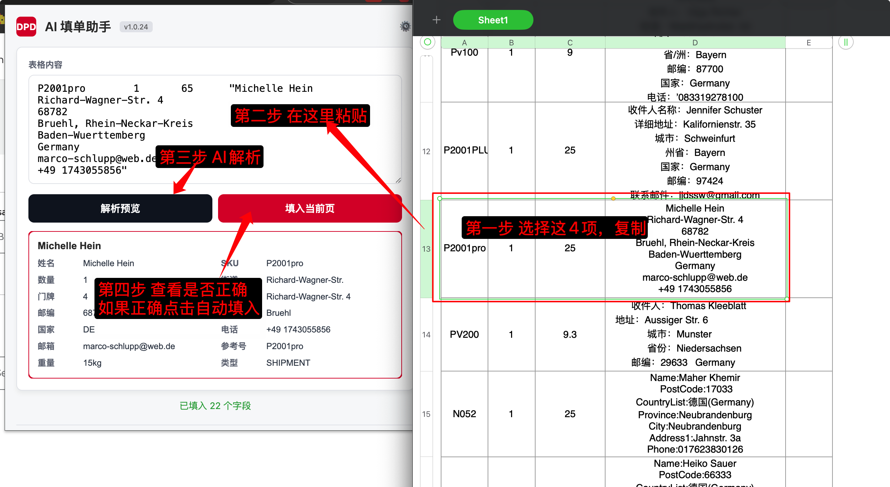

# DPD API 和 Chrome 扩展程序

Next.js 后端加上一个 Chrome 扩展程序，利用 AI 解析粘贴的 Excel 货运行数据，并自动填入 myDPD Business 表单。

---

如果您是开发人员，请参考 [DEVELOPMENT.md](./DEVELOPMENT.md) 了解环境配置与部署细节。
如果您需要定位字段或排查页面填写问题，请参考 [docs/extension-debugging.md](./docs/extension-debugging.md)。


## 🚀 快速开始（安装指南）

### 1. 下载插件
前往 [GitHub Releases](https://github.com/folgercn/dpd-api/releases) 页面，下载最新版本的 `dpd-extension.zip`。

### 2. 安装插件


1. 下载后请先 **解压** ZIP 文件到一个固定目录。
2. 打开 Chrome 浏览器，在地址栏输入 `chrome://extensions/` 并回车。
3. 在右上角开启 **“开发者模式” (Developer mode)**。
4. 点击左上角的 **“加载已解压的扩展程序” (Load unpacked)**。
5. 选择您刚才解压的文件夹。
6. 安装成功后，建议点击浏览器右上角的“拼图”图标，将 **DPD AI 助手** 固定到工具栏。
   

## 💡 使用方法
1. 在 Excel 或聊天窗口中复制要解析的文本。
2. 支持两种输入格式：
   - `4 列格式`：`SKU / 数量 / 重量 / 地址`
   - `单列格式`：只有地址文本，系统只解析地址
3. 在插件窗口中粘贴文本，先点击 **“解析预览”**。
4. 确认当前已经打开了正确的 DPD 页面，再点击 **“填入当前页”**。
5. 插件只会填写当前页面，不会自动跳转页面。

### 输入格式说明

#### 4 列格式
适用于常见物流表格，字段顺序固定为：

1. `SKU`
2. `数量`
3. `重量`
4. `地址`

示例：

```text
PV200	1	9.3	"收件人：Thomas Kleeblatt
地址：Aussiger Str. 6
城市：Munster
省份：Niedersachsen
邮编：29633 Germany
电话：015164315540"
```

说明：
- 第 1 列 `SKU` 会写入参考号
- 第 2 列 `数量` 会写入包裹数
- 第 3 列 `重量` 用于填写重量，并帮助判断你应该打开发货页还是退货页
- 第 4 列地址块才会发送给 AI 解析

#### 单列格式
如果手头只有地址文本，也可以直接粘贴。

示例：

```text
Frau Marlies Jurk
Kirchgasse 1
Bad Rodach
Bayern
Germany
96476
01735615703
```

说明：
- 这种模式下只解析地址
- 如果没有重量，插件不会替你判断页面类型
- 你需要自己先打开正确页面，再点 **“填入当前页”**



## 支持的 DPD 页面

### 20kg 以下 / 退货 (Return)
`https://business.dpd.de/retouren/retoure-beauftragen.aspx`

### 20kg 以上
`https://business.dpd.de/auftragsstart/auftrag-starten.aspx`

### 当前页填写规则

- 插件不会自动跳转到发货页或退货页
- 如果当前页面不对，插件会提示你先打开正确页面
- 建议先根据重量判断：
  - `20kg 以下`：打开退货页
  - `20kg 以上`：打开发货页
- 如果没有重量：由你自己判断并打开对应页面


## 🔄 如何更新插件

本插件支持 **自动版本检测**，确保您始终使用最新的识别逻辑和功能。

### 1. 接收更新提示
当有新版本发布时，插件窗口顶部会自动弹出黄色的提示条：**“🚀 发现新版本 v1.x.x! [立即下载]”**。

### 2. 下载与覆盖
1. 点击提示条中的 **“立即下载”**，或前往 [GitHub Releases](https://github.com/folgercn/dpd-api/releases) 下载最新的 `dpd-extension.zip`。
2. 将下载的 ZIP 包 **解压**。
3. **覆盖安装**：将解压后的所有文件，复制并粘贴到您第一次安装时的那个文件夹中，选择 **“替换所有文件”**。

### 3. 生效更新
1. 在 Chrome 的插件管理页面 `chrome://extensions/` 找到 DPD AI 助手。
2. 点击插件卡片右下角的 **“刷新”（圆形箭头）** 图标。
3. 更新完成！

### 4. 查看当前版本号
您可以随时点击插件图标，在弹出窗口顶部的标题旁边（例如 **v1.0.18**）查看当前正在运行的版本。
